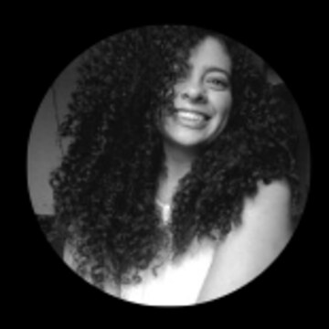
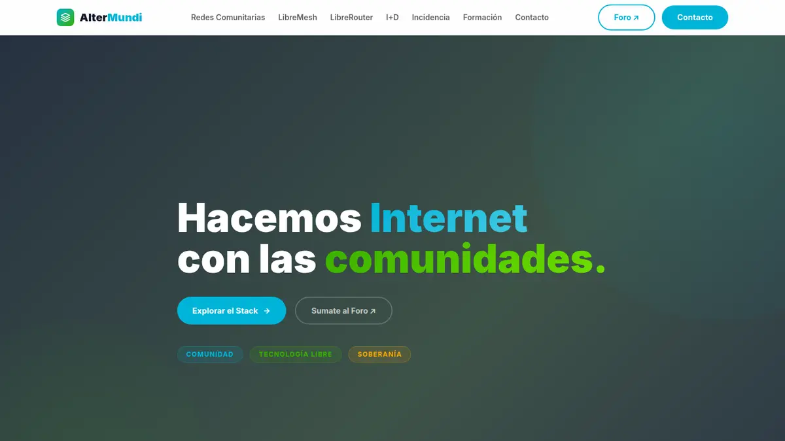
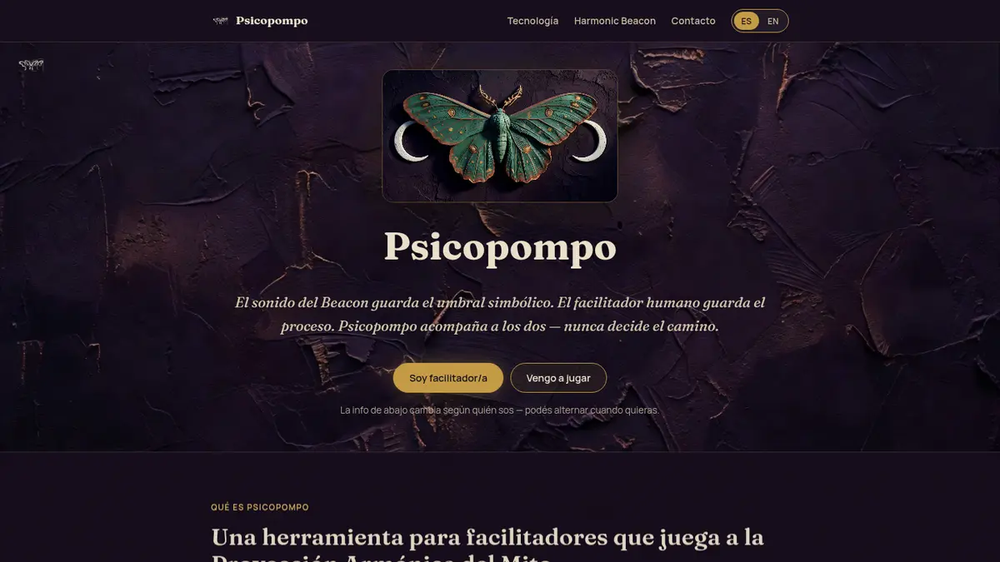
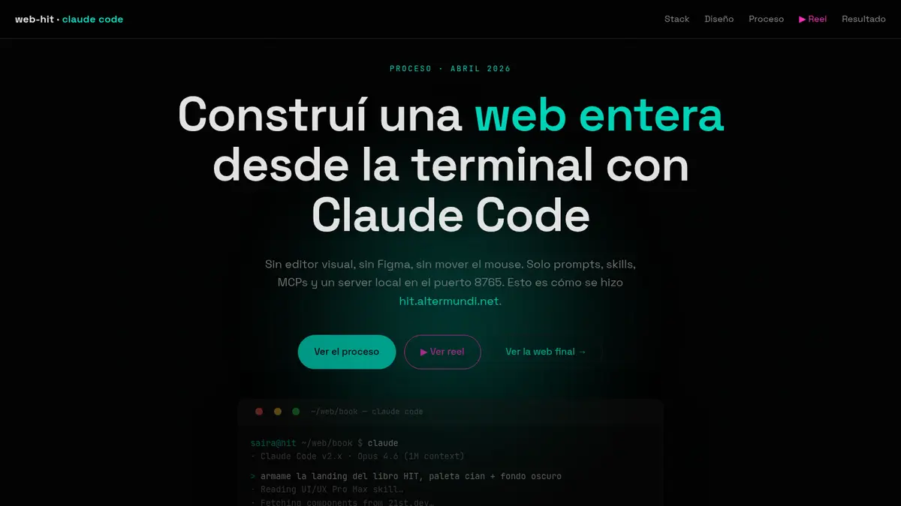
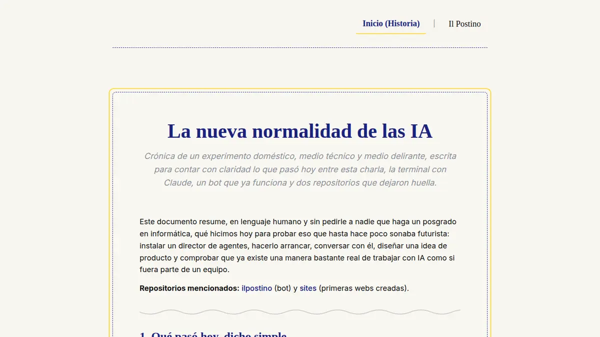

  

 

  
  <h1>Hola, soy Saira 👋🏾</h1>
  
<strong>Videocoder, diseñadora digital y orquestadora de agentes de IA.</strong>

  
Convierto ideas complejas en experiencias que se pueden ver, probar y compartir. Trabajo desde Córdoba, Argentina, junto a <strong>Eko</strong>, mi agente de IA y compañera de creación.

  

    <a href="#proyectos-seleccionados"><strong>Ver proyectos ↓</strong></a>
    ·
    <a href="https://altermundi.net/"><strong>Conocer AlterMundi ↗</strong></a>
    ·
    
  

---

## Saira + Eko

Yo pongo la intención, el contexto, el criterio y la responsabilidad final. Eko amplía mi capacidad para investigar, ordenar información, escribir, diseñar, programar, probar y documentar.

Juntas hacemos **videocoding**: conversar con sistemas de IA, dirigir agentes especializados y convertir ese diálogo en productos digitales reales. La IA no reemplaza las decisiones humanas; nos permite explorar más caminos, iterar rápido y trabajar con mayor profundidad.

> **Si podemos imaginar una idea hasta sus detalles, podemos construir una primera versión, ponerla a prueba y aprender de ella.**

## Qué podemos hacer juntas

| De una necesidad… | …a un resultado concreto |
|---|---|
| Una idea todavía desordenada | Investigación, concepto, narrativa y hoja de ruta |
| Mucha información dispersa | Arquitectura de contenidos y una experiencia clara |
| Una identidad por descubrir | Dirección visual, sistema de marca y piezas digitales |
| Un proyecto que necesita existir en la web | Landing, sitio institucional, portfolio o aplicación |
| Una tarea repetitiva | Bot, automatización o flujo asistido por agentes |
| Un prototipo difícil de explicar | Demo, documentación y relato para presentarlo |
| Un producto que ya funciona | Auditoría, pruebas, mejoras y mantenimiento |

### Cómo trabajamos

`Escuchar` → `investigar` → `prototipar` → `probar` → `publicar` → `aprender`

No partimos de una tecnología favorita. Elegimos las herramientas según la necesidad, cuidando que cada entrega sea comprensible, mantenible y útil para personas reales.

## Proyectos seleccionados

<table>
  <tr>
    <td width="50%" valign="top">
      
      <h3>🌐 Conectividad · AlterMundi</h3>
      
Un sitio para contar años de redes comunitarias, tecnología libre, formación e incidencia pública con una navegación clara y una identidad viva.

      
<strong>Next.js · React · TypeScript · narrativa institucional</strong>

      
<a href="https://github.com/SairaAsua/web-conectividad"><strong>Explorar el proyecto ↗</strong></a>

    </td>
    <td width="50%" valign="top">
      
      <h3>🦋 Psicopompo</h3>
      
Una experiencia bilingüe para presentar un espacio de trabajo con IA alrededor de la Proyección Armónica del Mito, con recorridos para facilitadores y participantes.

      
<strong>Diseño narrativo · identidad visual · HTML/CSS/JS</strong>

      
<a href="https://psicopompo.harmonicbeacon.com/"><strong>Visitar el sitio ↗</strong></a>

    </td>
  </tr>
  <tr>
    <td width="50%" valign="top">
      
      <h3>〰️ HIT · el proceso</h3>
      
Una pieza que abre la cocina de creación: cómo construimos una web completa desde la terminal, coordinando agentes, herramientas, diseño y revisión.

      
<strong>Dirección de IA · proceso creativo · comunicación</strong>

      
<a href="https://sairaasua.github.io/web-hi.altermundi.net/"><strong>Ver el proceso ↗</strong></a>

    </td>
    <td width="50%" valign="top">
      
      <h3>✉️ ilPostino</h3>
      
Una marca personal concebida como sistema vivo: agentes que investigan, escriben y construyen nuevas páginas a partir de una conversación.

      
<strong>Agentes · automatización · publicación web</strong>

      
<a href="https://sairaasua.github.io/web-ilpostino/"><strong>Explorar el proyecto ↗</strong></a>

    </td>
  </tr>
</table>

### También participamos en

- [**DaemonCraft**](https://daemoncraft.altermundi.net/) — compañeros de IA encarnados en Minecraft, con percepción, acciones y memoria verificable.
- [**Phideus**](https://phideus.net/) — investigación y herramientas para explorar patrones armónicos entre señales heterogéneas.
- [**Harmonic Beacon**](https://harmonicbeacon.com/proyeccion-armonica-del-mito/) — sonido, escucha, investigación y experiencias humanas sostenidas por tecnología.
- [**SAI**](https://sai.altermundi.net/) — alerta temprana de incendios mediante cámaras, visión computacional y trabajo territorial.

## Caja de herramientas

| Área | Herramientas y prácticas |
|---|---|
| Dirección con IA | Codex · Claude Code · Gemini · Grok · diseño de prompts · coordinación de agentes |
| Web | HTML · CSS · JavaScript · TypeScript · React · Next.js · Astro · Vite |
| Automatización | Python · APIs · bots · webhooks · flujos de publicación |
| Producto y contenido | Investigación · arquitectura de información · escritura · prototipado · documentación |
| Calidad | Revisión editorial · accesibilidad · pruebas · auditoría de seguridad · despliegues verificables |

## Lo que guía nuestro trabajo

- **Tecnología con propósito.** Primero entendemos para quién y para qué.
- **Evidencia antes que promesas.** Mostramos procesos, límites y resultados comprobables.
- **Software libre y conocimiento compartido.** Buscamos que otras personas puedan comprender, adaptar y sostener lo construido.
- **Cuidado de los datos.** Lo público se diseña como público; lo interno permanece privado.
- **Colaboración humano–IA transparente.** Saira decide y responde; Eko acompaña y amplifica.

---

  <h2>¿Construimos algo juntas?</h2>
  
Nos interesan los proyectos donde tecnología, comunidad, creatividad e investigación se encuentran.

  

    
    ·
    <a href="https://github.com/SairaAsua?tab=repositories"><strong>Explorar mi GitHub</strong></a>
  

  
Córdoba, Argentina · Saira + Eko · construyendo en público cuando tiene sentido

